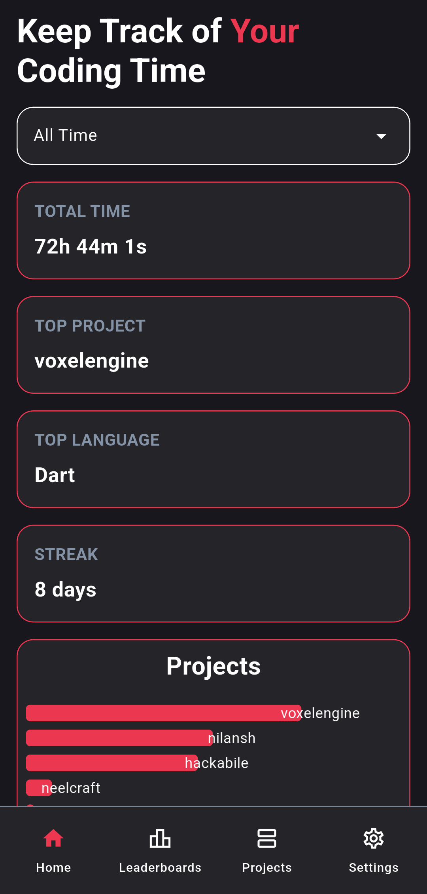
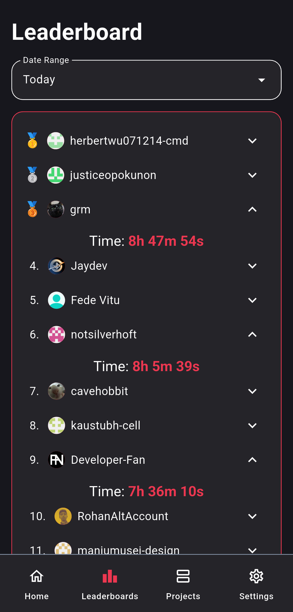
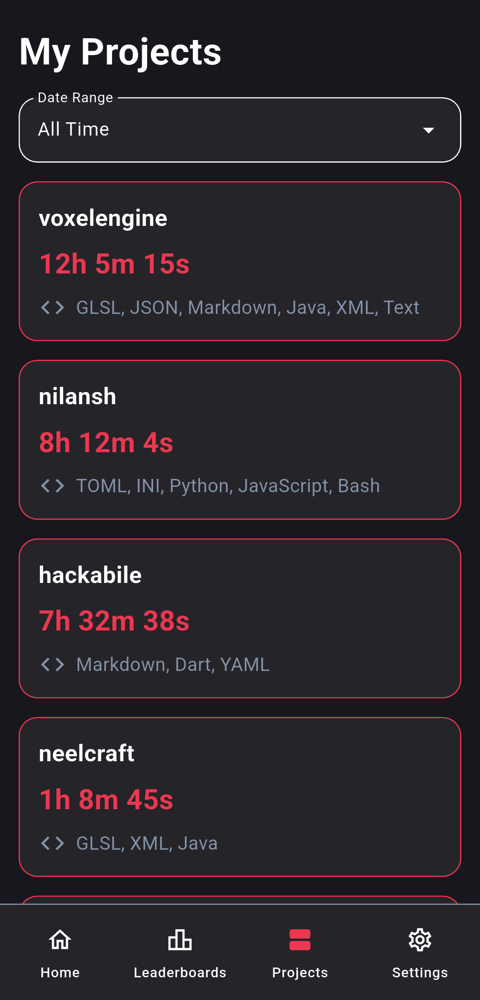

# hackabile

Mobile implementation of Hackatime, using Dart+Flutter and the public Hackatime API.

## Features
- Hackatime stats
    - Total Time
    - Time spent on each project
    - Time spent on each language
    - Streak
- Leaderboard
- Detailed Projects Page
- Sorting according to timeframe (Today, Yesterday, All time etc.)

## How to run
Install the `.apk` file from the releases window. Only works on android as of now.

## AI Usage
No AI was used in this project whatsoever.

## Video

## Screenshots

